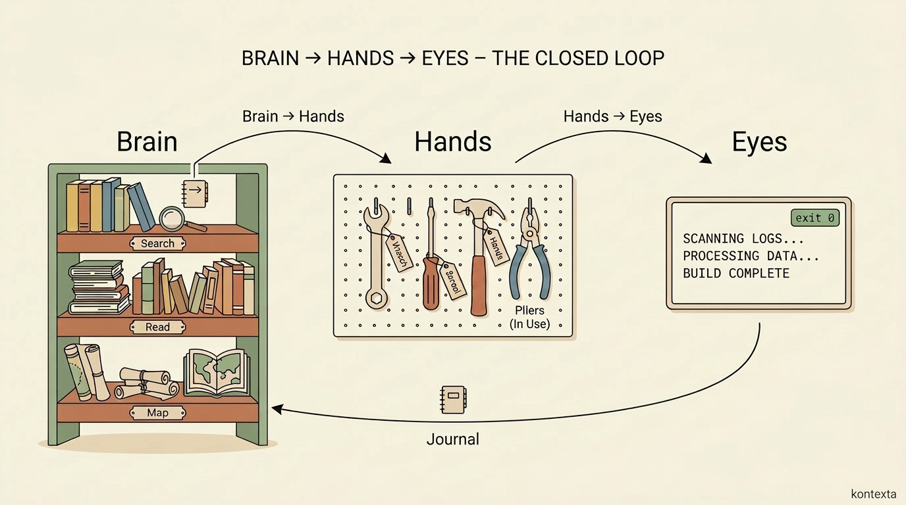
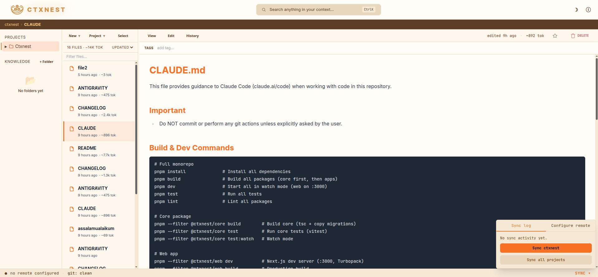

<h1 align="center">
  <br>
  Kontexta
</h1>
<p align="center"><i>(pronounced <b>kon-TEX-tah</b>)</i></p>
<p align="center"><b>One memory. One toolbox. One feedback loop. Any agent.</b></p>

<p align="center">
  <a href="https://glama.ai/mcp/servers/safiyu/kontexta"></a>
</p>

Kontexta is a local-first **Model Context Protocol (MCP)** server that gives your AI coding agents — **Claude Code**, **Cursor**, **Gemini**, **Antigravity** — a persistent memory and a controlled command surface. 

Instead of agents losing context between sessions or inventing their own shell commands, Kontexta provides:
- **Brain**: A git-backed markdown vault with FTS5 search and surgical section edits.
- **Hands**: A sandboxed command engine defined by you in `kontexta.json`.
- **Eyes**: A feedback loop that journals results back into the brain.

## The Unique Value

Most AI tools trap context inside their own chat window. Kontexta moves that context to your own SSD, providing six core advantages:

### 1. Cross-Agent Handoff
- **Switch agents mid-project**: Claude Code journals a decision; Cursor reads it 5 minutes later.
- **Unified command surface**: Author your `kontexta.json` once; every agent uses the same validated tools and approval gates.
- **Multi-agent collaboration**: Different agents working on different tasks contribute to the same indexed knowledge base.
- **Zero-touch onboarding**: `register_project` + `onboard_agent` injects a fenced, version-stamped workflow rules block into `CLAUDE.md` / `AGENTS.md` / `GEMINI.md` / `.cursor/rules` / `.continue/rules` so every new conversation — on any agent — wakes up already knowing how to use kontexta.

### 2. Cross-Project Awareness
- **Global reach**: An agent working in Project A can instantly search and read the documentation, context, and states of Project B.
- **Shared standards**: Solve a problem once, document it, and let your agent apply that solution across all your other projects automatically.
- **Heads-up on sensitivity**: Because the vault is global, every registered project is readable by any agent session you start. If you mix client work with personal projects, keep sensitive material in a separate vault (`KONTEXTA_DATA_DIR`) rather than registering it alongside everything else.

### 3. Deterministic Context Retrieval
- **SQLite FTS5 Power**: Instead of unpredictable vector-based RAG, Kontexta uses high-performance full-text indexing for deterministic, local-first context discovery.
- **Reliable Discovery**: Fast, exact keyword and regex-based search ensures you find what you're looking for without the "hallucination" risk of third-party embedding providers.

### 4. Token-Optimized Context Economy
- **Surgical fetching**: Instead of indiscriminately dumping whole directories into the LLM's context window, Kontexta provides tools to fetch specific file outlines, sections, or targeted search excerpts.
- **Budget awareness**: Every tool response includes `est_tokens` so agents can smartly budget what they pull into memory.

### 5. Separation of Code and Context
- **The "Context.md" Killer**: Stop littering your source tree with `CONTEXT.md` or `AI_NOTES.md` files that clutter your PRs and get stale.
- **Global Knowledge Vault**: Keep your main codebase pristine. Architectural decisions, agent journals, and cross-project standards live in a separate, dedicated global vault accessible by any agent instance.

### 6. Compounding Intelligence
- **Continuous learning**: Through the "Eyes" and journaling system, your AI agents document their decisions, successes, and mistakes.
- **Smarter next time**: A problem solved today is saved in the Brain, meaning tomorrow's session starts with the benefit of yesterday's experience.

---

## Architecture: Brain → Hands → Eyes

Kontexta builds a closed feedback loop that makes every turn smarter than the last.

<p align="center">
  
</p>

### 1. Brain — The Context Engine
A markdown knowledge vault optimized for context-window economy.
- **FTS5 Search**: Instant local keyword search.
- **Surgical Edits**: Tools for reading and updating specific markdown sections without pulling entire files.
- **Token-Aware**: Every response includes `est_tokens` and `size_bytes` so agents can budget their context.

### 2. Hands — The Command Engine
A project-defined command surface that replaces "unrestricted shell access" with a sandboxed contract.
- **Explicit boundaries**: You declare exactly what an agent can do via `kontexta.json`. There is no unrestricted shell access.
- **Sandboxed**: Locked working directory, clean environment, and ring-buffered output.
- **Human-in-the-loop**: High-risk commands can require a cryptographic one-time token, pausing execution until you explicitly approve it.

> [!IMPORTANT]
> The sandbox enforces *your* contract — it doesn't infer risk on its own. A command only requires approval if you mark it high-risk in `kontexta.json`; anything else runs unattended within the sandbox. Treat `kontexta.json` like a permissions file: the security posture is exactly as careful as your authorship of it.

### 3. Eyes — The Feedback Engine
Closes the loop by capturing Hands' output and journaling learnings back into the Brain.
- **Live Observation**: Tools like `whats_new` and `diff_against_disk` let agents see what actually changed.
- **Automatic journaling**: Every MCP tool call is captured to a per-project, append-only event log (Layer 1). The `distill_journal` tool — or the lenient-mode auto-fallback — collapses raw events into per-topic markdown summaries (Layer 2) indexed alongside the rest of the knowledge base. `journal_note` and `journal_intent` let agents enrich the log with decisions and topic pivots. Phase 2 also adds `housekeep_journal` (retention/archival), `distill_journal_commit_upgrades` (closes the subagent dispatch loop), strict mode (configurable per project — blocks read tools when backlog exists), and an opt-in WebUI scheduler that runs mechanical distillation on a 15-minute clock when the dashboard is installed. **[Learn more about Journaling modes and configuration in docs/JOURNAL.md](docs/JOURNAL.md).**

---

## How it Works in Practice

Imagine you are switching from **Claude Code** to **Cursor** mid-way through a feature.

### The Problem: The "Context Gap"
- **Claude Code** knows why you chose that specific library.
- **Cursor** doesn't. You have to copy-paste or re-explain everything.
- **CONTEXT.md** files help, but they get stale, they clutter your PRs, and they don't capture live decisions.

### The Kontexta Solution
1. **Journaling**: As Claude Code works, kontexta automatically captures every tool invocation and decision to a structured event log.
2. **Persistence**: Those logs are saved in your local Kontexta brain, not the chat window. The `distill_journal` tool consolidates raw events into per-topic markdown entries that are searchable alongside your knowledge base.
3. **Seamless Handoff**: When you open Cursor, it immediately sees the recent journal entries and architectural state via the Kontexta MCP. 
4. **Zero Re-explanation**: Cursor "wakes up" with the exact same context Claude had.

---

## How Kontexta Compares

Kontexta doesn't try to replace your favorite agent or memory library — it sits in a different spot. Here's an honest read of where it overlaps and where it doesn't:

| Capability | `CLAUDE.md` / `AGENTS.md` | Vendor memory (Cursor rules, Claude Projects) | mem0 | Zep | **Kontexta** |
| :--- | :--- | :--- | :--- | :--- | :--- |
| **Setup cost** | None — just a file | None — built in | SDK integration in your app | SDK + service | MCP server + `kontexta.json` |
| **Cross-agent portability** | Per-agent flavored files drift apart | Locked to one vendor | App-level, not agent-level | App-level, not agent-level | Same MCP surface for Claude Code, Cursor, Gemini, Antigravity |
| **Retrieval model** | Whole file dumped into context | Whole file / vendor-managed | Vector + graph (semantic) | Temporal knowledge graph (semantic) | Deterministic FTS5 + regex; surgical section reads |
| **Token accounting** | None | None | None exposed to agent | None exposed to agent | Every response carries `est_tokens` / `size_bytes` |
| **Command execution** | N/A | Vendor-defined tools | N/A (memory only) | N/A (memory only) | Sandboxed `Hands` with per-command contracts and approval tokens |
| **Storage** | Repo file (clutters PRs) | Vendor cloud | Self-host or hosted, vector DB | Self-host or hosted | Local SQLite, git-synced markdown vault |
| **Best at** | Static project conventions | Zero-config personal memory | Semantic recall inside one app | Long-running conversational memory | Multi-agent handoff + governed local execution |

**Honest tradeoffs:**
- If you only use one agent and one project, `CLAUDE.md` or vendor memory is simpler — reach for Kontexta when you're switching agents or coordinating across projects.
- mem0 and Zep do semantic recall that FTS5 doesn't; Kontexta trades fuzzy matching for determinism and local-only operation.
- Kontexta's `Hands` sandbox has no equivalent in the memory tools above — that's the unique surface, not the memory itself.

---

## Quick Start (5-Minute Trial)

### 1. Run the MCP Server (No Install)
The fastest way to try Kontexta is via `npx`. Add this to your MCP client configuration (e.g., `mcpServers.json`):

```json
{
  "mcpServers": {
    "kxta": {
      "command": "npx",
      "args": ["-y", "kontexta-mcp"],
      "env": {
        // Optional: defaults to your OS-standard data directory
        // "KONTEXTA_DATA_DIR": "/absolute/path/to/your/knowledge-vault"
      }
    }
  }
}
```

### 2. Run the Dashboard (Docker)
For the full "Obsidian-meets-Terminal" UI, download the compose file, edit your volume mounts and environment variables (e.g., project paths), and run:

```bash
curl -fsSL https://raw.githubusercontent.com/safiyu/kontexta/main/docker-compose.hub.yml -o docker-compose.yml
# Important: Open docker-compose.yml and edit the volumes section 
# to mount your projects directory so the agent can see them.
docker compose up -d
```
The UI lands at `http://localhost:3000`.

---

## Security & Network Exposure

Kontexta's dashboard is designed for **local-first use** — running on `localhost` or on a trusted machine you control. The threat model is:

- **Default safe:** A master password protects the UI. Sessions are HMAC-signed cookies, passwords are scrypt-hashed.
- **IP bypass is opt-in per IP.** During setup you can allowlist IPs (e.g. `127.0.0.1`) to skip the login prompt from trusted addresses.
- **Reverse-proxy mode is opt-in.** If you put Kontexta behind nginx, Caddy, or Cloudflare Tunnel, enable **"Trust `X-Forwarded-For` headers"** during setup. Without this flag, those headers are ignored — so a LAN attacker cannot spoof an allowlisted IP.
- **`kontexta.json` is your responsibility.** The Hands engine executes shell commands you declare in this file. The sandbox limits *where* and *how* those commands run (path traversal blocked, ReDoS-proof regex, locked CWD, stripped PATH), but the *what* is whatever you wrote. Review any `kontexta.json` you didn't author yourself — same caution you'd apply to a Makefile, GitHub Actions workflow, or shell snippet from the internet.

> [!WARNING]
> Do not expose the dashboard to the public internet without a trusted reverse proxy in front. The auth layer is sufficient for localhost and LAN use; it is not hardened against direct internet exposure (no rate limiting, no brute-force lockout, no MFA).

---

## Demo & Walkthrough

<p align="center">
  <a href="https://youtu.be/kghe72WjahY">
    
  </a>
</p>

**In this demo:**
- System audit and web clipping.
- Local RAG and context gathering.
- The Brain/Hands/Eyes loop in action.

**No-install demo:** Try the MCP endpoints interactively right from your browser on the [Glama Kontexta page](https://glama.ai/mcp/servers/safiyu/kontexta).

---

## Project Status & Transparency

**Why the high version number on a fresh repository?**
If you look at the commit history, you might wonder how a repository with so few commits reached its current major version. 

Kontexta wasn't built over a weekend. It began over a year ago as a private, monolithic toolchain used to manage complex, multi-agent coding workflows. The versioning reflects its true architectural maturity. 

Recently, I undertook a major effort to industrialize and modularize this engine, restructuring it into the three core pillars you see today: **Brain**, **Hands**, and **Eyes**. This process involved decoupling the core from private infrastructure and moving to a clean, open-source monorepo. The condensed git history is the result of this clean extraction—leaving behind internal legacy commits to publish only the battle-tested, production-ready framework available today.

---

## Roadmap

What's deliberately deferred and what triggers will pull it forward lives in [`docs/ROADMAP.md`](docs/ROADMAP.md). Notable open items: per-call project resolution in journaling, server-side LLM upgrade for the WebUI scheduler, and Layer 3 (embeddings + graph + semantic clustering).

---

## Features Breakdown

### Brain
- Global vault with two-way git sync.
- 52 MCP tools tuned for context economy.
- Batch operations (up to 500 files/call), grep, and regex support.
- Web clipping with auth-wall detection.
- Full git-backed versioning: `get_history`, `get_diff`, `restore_file`.
- **Agent context rules onboarding:** `register_project` detects existing `CLAUDE.md` / `AGENTS.md` / `GEMINI.md` / `.cursor/rules/*.mdc` / `.continue/rules/*.md` and recommends a follow-up. The `onboard_agent` tool injects an idempotent, version-fenced workflow rules block (or scaffolds one for the right agent) so every new conversation starts already aware of kontexta's conventions.

### Hands
- Project-specific `kontexta.json` tools map.
- Strict sandbox: realpath-verified CWD, stripped `PATH`, and hard timeouts.
- ReDoS-proof parameter validation via `re2`.
- CSPRNG-bound confirmation tokens for high-risk commands.

### Dashboard
- Built-in `/docs` page with a searchable catalogue of all 52 core tools.
- Form-based `kontexta.json` editor with live validation.
- Real-time status bar streaming git activity over WebSockets.

---

> [!TIP]
> Deleting a project file in Kontexta only un-indexes it from the AI's memory. Your physical source code is never touched.

---

## Contributing

Kontexta is a project for developers, by developers. If you'd like to contribute new tools, improve the core engine, or refine the dashboard, please see our [CONTRIBUTING.md](CONTRIBUTING.md) for architecture guidelines and local setup instructions.

Built with care for the future of agentic coding.
License: Apache-2.0
