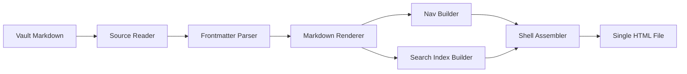

# kontexta Publish

kontexta Publish is a static documentation site generator that reads markdown files from your kontexta vault and renders them into a beautiful, self-contained single-page application.

## What it does

- **Reads** markdown files from your kontexta vault's knowledge folder
- **Renders** markdown with support for special blocks (mermaid diagrams, API endpoints, glossary terms)
- **Generates** a single HTML file with embedded CSS, JavaScript, and data
- **Provides** a three-pane layout with sidebar navigation, content area, and table of contents
- **Includes** client-side search, theme toggle, and responsive design

## Quick start

1. Write markdown files in your kontexta vault's knowledge folder
2. Add frontmatter to control ordering and grouping
3. Run `kxta-publish` to generate your docs site
4. Open the generated HTML file in your browser

## Features

### Special Blocks

kontexta Publish supports several special markdown blocks:

- **Mermaid diagrams** — Create flowcharts, sequence diagrams, and more
- **API endpoints** — Document your API with interactive cards and modal details
- **Glossary terms** — Build a searchable glossary of terms

### Navigation

- Automatic sidebar navigation grouped by folder
- Table of contents in the right rail
- Hash-based routing for deep linking
- Scroll-spy to highlight current section

### Search

- Client-side search over all document content
- Search by page title, heading, or content
- Filter by type (page, heading, endpoint, term)

### Theming

- Dark mode by default
- Light mode toggle
- kontexta theme tokens (accent colors, typography, spacing)

## Architecture

## Next Steps

- Read the [API Documentation](#/getting-started/api) to learn about special blocks
- Check out the [Glossary](#/getting-started/glossary) for key terms
- Explore the [Improvements](#/getting-started/improvements) section for future plans
