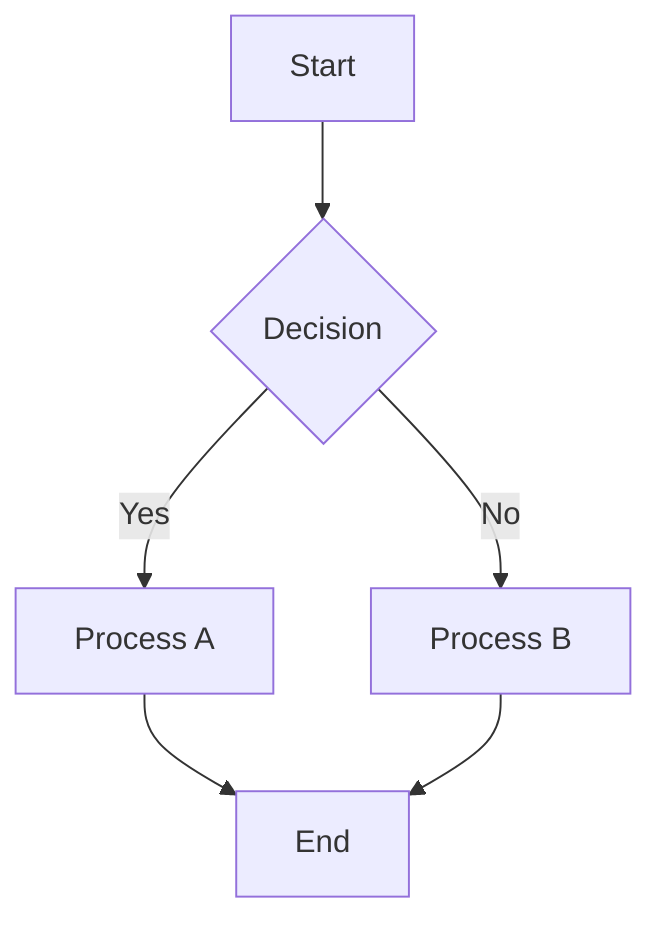
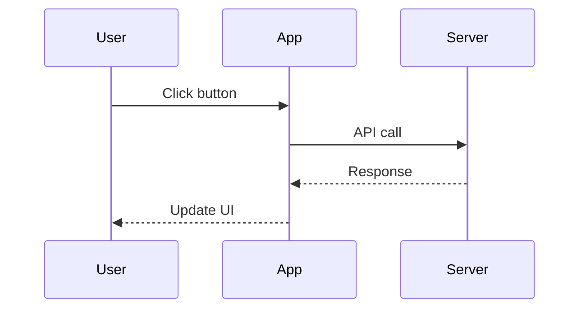

# Special Blocks

kontexta Publish supports several special markdown blocks that enhance your documentation with interactive elements.

## Mermaid Diagrams

Create diagrams using Mermaid syntax. Wrap your diagram code in a fenced code block with the `mermaid` language tag.

### Example: Flowchart



### Example: Sequence Diagram



### Features

- **Zoom** — Use the zoom buttons or Ctrl+wheel to zoom in/out
- **Fullscreen** — Click the fullscreen button or press Ctrl+Enter
- **Auto-render** — Mermaid diagrams are automatically rendered on page load

## API Endpoints

Document your API endpoints using the `endpoints` block. Each endpoint is rendered as an interactive card.

### Example

```endpoints
- method: GET
  path: /api/v1/docs
  badge: stable
  description: List all available documentation pages
  headers:
    Authorization: Bearer token required
    Accept: application/json
  statusCodes:
    "200": Success — returns list of pages
    "401": Unauthorized — invalid or missing token
  request: |
    GET /api/v1/docs HTTP/1.1
    Host: example.com
    Authorization: Bearer <token>
  response: |
    HTTP/1.1 200 OK
    Content-Type: application/json
    
    {
      "pages": [
        {"title": "Overview", "slug": "overview"},
        {"title": "API", "slug": "api"}
      ]
    }
```

### Endpoint Card Features

- **Method badge** — Color-coded HTTP method (GET, POST, PUT, DELETE, etc.)
- **Interactive modal** — Click any endpoint card to see full details
- **Status codes** — Document expected responses
- **Request/Response** — Show example request and response bodies

## Glossary Terms

Build a searchable glossary using the `glossary` block.

### Example

```glossary
- term: kontexta
  definition: A local-first knowledge and context engine for AI coding agents.
- term: vault
  definition: The storage location for markdown knowledge files, typically in ~/.local/share/kontexta/knowledge/.
- term: MCP
  definition: Model Context Protocol — a standard for connecting AI models to external data sources.
- term: FTS5
  definition: Full-Text Search version 5, SQLite's built-in full-text search engine.
```

### Glossary Features

- **Alphabetical display** — Terms are displayed in alphabetical order
- **Searchable** — Terms appear in the search results
- **Clickable** — Click any term to jump to its definition

## Frontmatter

Every markdown file can include frontmatter at the top to control how it's rendered.

### Available Fields

| Field | Type | Required | Description |
|-------|------|----------|-------------|
| `title` | string | Yes | Display title for the page |
| `group` | string | No | Navigation group name (defaults to folder name) |
| `order` | number | No | Sort order within the group (lower = first) |
| `icon` | string | No | Emoji or icon to display in navigation |

### Example

```yaml
---
title: My Page
group: Documentation
order: 5
icon: 📄
---
```

## Code Blocks

Standard markdown code blocks are supported with syntax highlighting.

### JavaScript Example

```javascript
function greet(name) {
  return `Hello, ${name}!`;
}

console.log(greet('World'));
```

### TypeScript Example

```typescript
interface User {
  id: number;
  name: string;
  email: string;
}

function createUser(id: number, name: string, email: string): User {
  return { id, name, email };
}
```

### Bash Example

```bash
# Install kontexta publish
npm install -g kxta-publish

# Generate docs
kxta-publish --folder docs --output index.html
```
